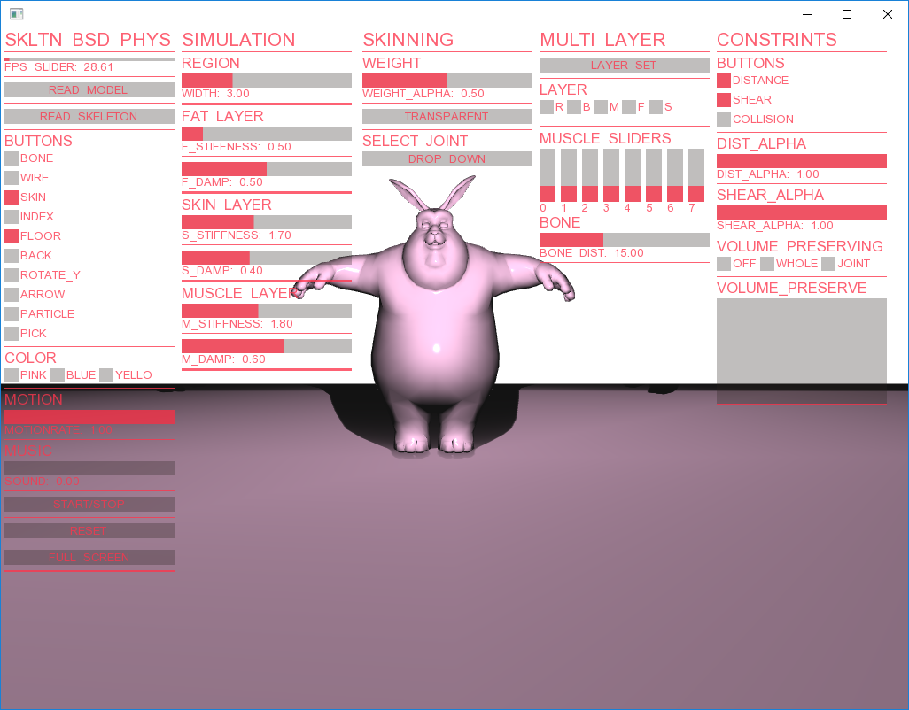

# Multi-layer Lattice Model for Real-Time Dynamic Character Deformation
Naoya Iwamoto, Hubert P.H. Shum, Longzhi Yang, Shigeo Morishima  
Pacific Graphics 2015   

DOI: http://dl.acm.org/citation.cfm?id=2851390  
Demo: https://www.youtube.com/watch?v=xgx6M9o_RUs  

---

## Environments
+ Windows 7
+ Visual Studio 2012
+ openFrameworks v0.8.4

## Dependensies
+ ofxBvh
+ ofxUI
+ ofxXmlSetting
+ ofxLSM (original)
+ ofxOBJ (original)

まとめてここでダウンロード: https://drive.google.com/open?id=0B-q5ebp6ik93ZHFHYXBCRDhfVWM

## Model
Rabbitモデル(bin/data以下を参照)

## Control
+ s : アニメーションstart/stop
+ f : フルスクリーンのon/off
+ g : GUIのon/off
+ r : リセット
+ p : 頂点選択
+ w : ワイヤー表示
